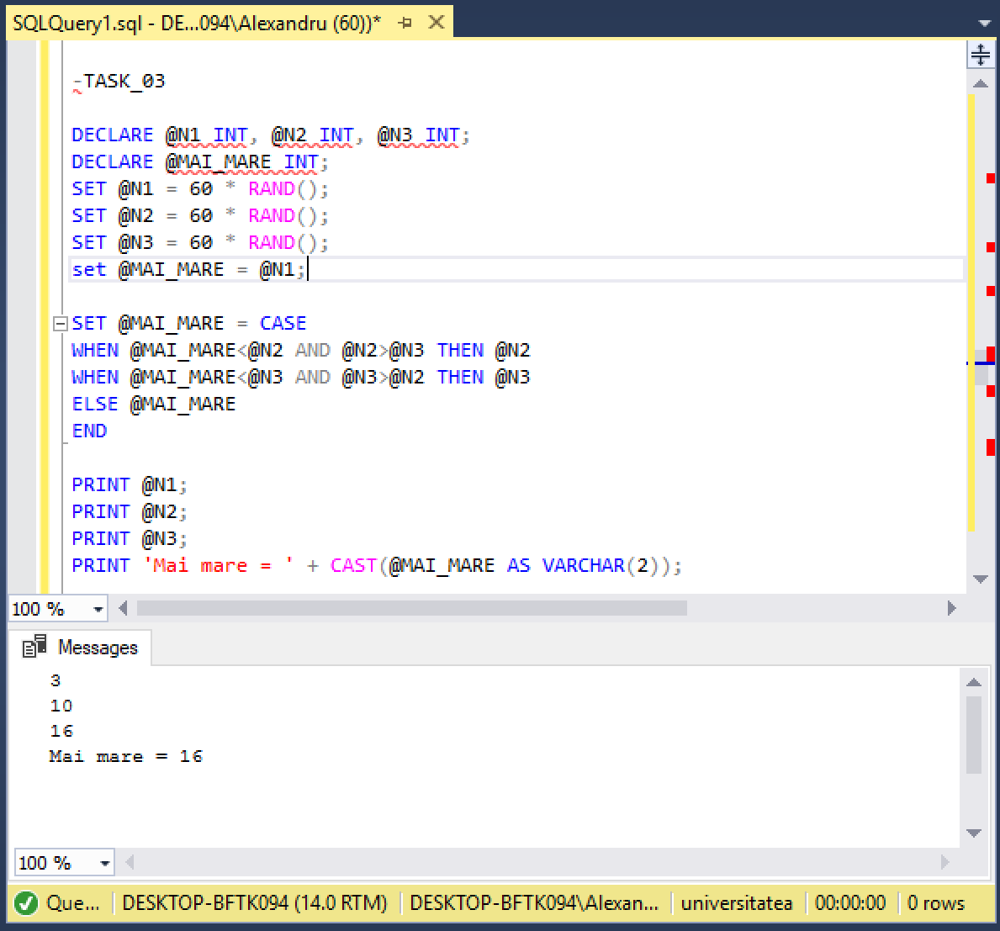
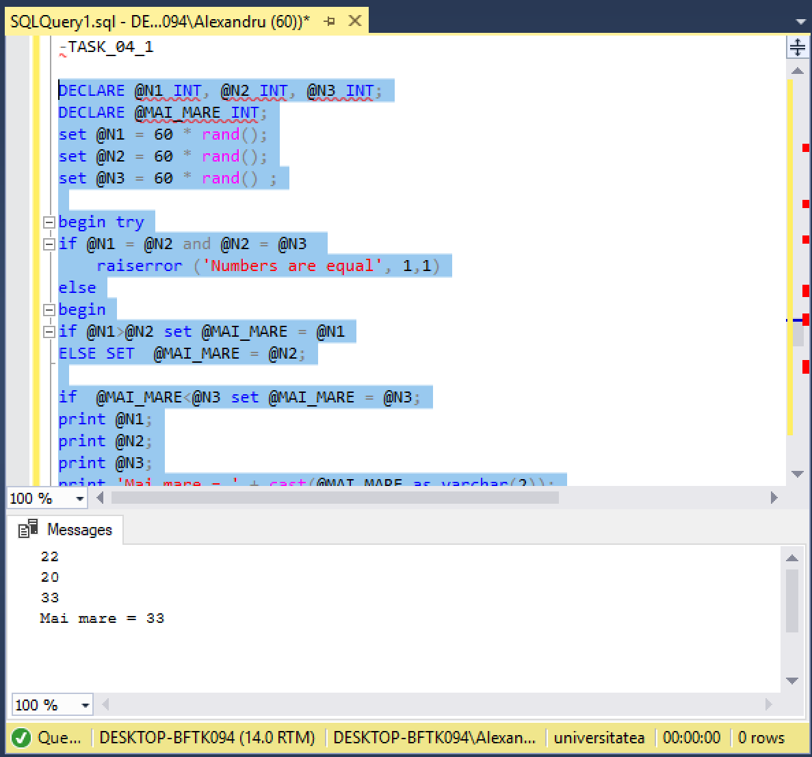
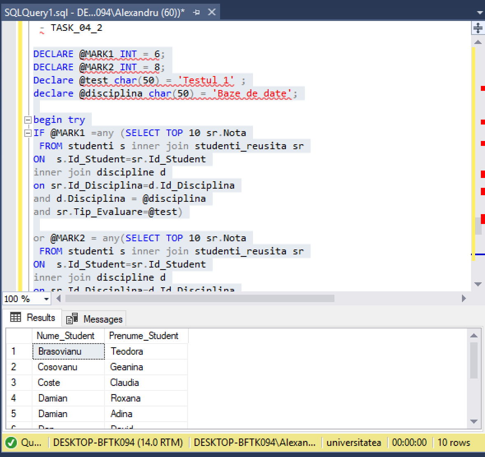

# Laboratorul Nr.5
# TRANSACT-SQL-INSTRUCTIUNI PROCEDURALE

TASK_01
Completati următorul cod pentru a afișa cel mai mare numar dintre cele trei numere prezentate:

```SQL
declare @first int, @second int, @third int;
declare @higher int;

set @first = rand() * 25;
set @second = rand() * 25;
set @third = rand() * 25;

if @first < @second set @higher = @second
else set @higher = @first;
if @higher < @third set @higher = @third;

print 'First number = ' + cast(@first as varchar(2)); 
print 'Second number = ' + cast(@second as varchar(2));
print 'Third number = ' + cast(@third as varchar(2)); 
print 'Higher number is: ' + cast(@higher as varchar(2));

```


- TASK_02
Afișati primele zece date (numele, prenumele studentului) în funcție de valoarea notei (cu excepția notelor 6 și 8) a studentului la primul test al disciplinei Baze de date, folosind structura de altemativă IF. .. ELSE. Sa se foloseasca variabilele.

```

declare @Nume_Disciplina varchar(20) = 'Baze de date';
declare @Tipul_Testului varchar(20) = 'Testul 1';
declare @Nota1 int = 6;
declare @Nota2 int = 8;

if @Nota1 !=any (select  top (10) Nota
from studenti, studenti_reusita, discipline
where studenti.Id_Student = studenti_reusita.Id_Student
and discipline.Id_Disciplina = studenti_reusita.Id_Disciplina
and Disciplina = @Nume_Disciplina
and Tip_Evaluare = @Tipul_Testului)

and @Nota2 != any (select  top (10) Nota
from studenti, studenti_reusita, discipline
where studenti.Id_Student = studenti_reusita.Id_Student
and discipline.Id_Disciplina = studenti_reusita.Id_Disciplina
and Disciplina = @Nume_Disciplina
and Tip_Evaluare = @Tipul_Testului)

begin

select  top (10) Nume_Student, Prenume_Student, Nota
from studenti, studenti_reusita, discipline
where discipline.Id_Disciplina = studenti_reusita.Id_Disciplina
and studenti.Id_Student = studenti_reusita.Id_Student
and Disciplina = @Nume_Disciplina
and Tip_Evaluare = @Tipul_Testului
and Nota not in (@Nota1, @Nota2)

end
```


-TASK_03
Rezolvati aceeași sarcină, 1, apelând la structura selectivâ CASE.




-TASK_04_01
Modificati exercitiile din sarcinile 1 și 2 pentru a include procesarea erorilor cu TRY și CATCH, și RAISERRROR.




-TASK_04_02


